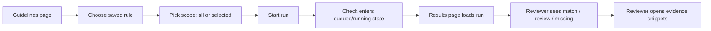
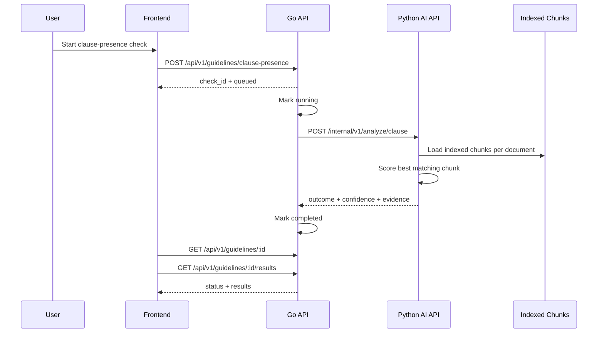
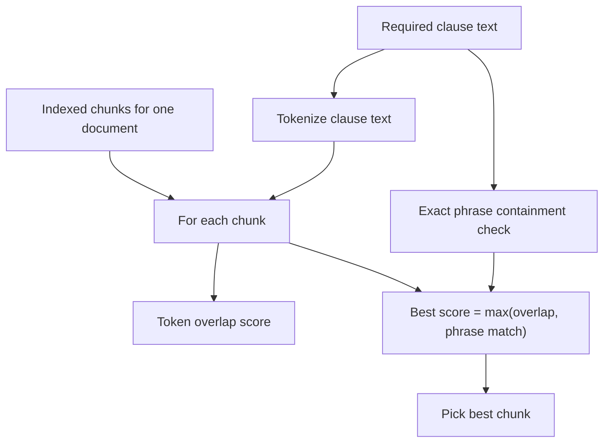
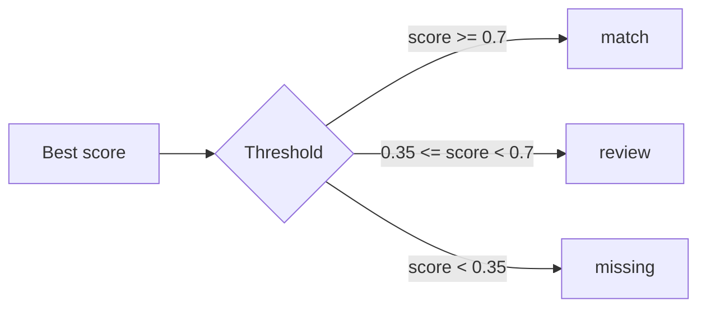
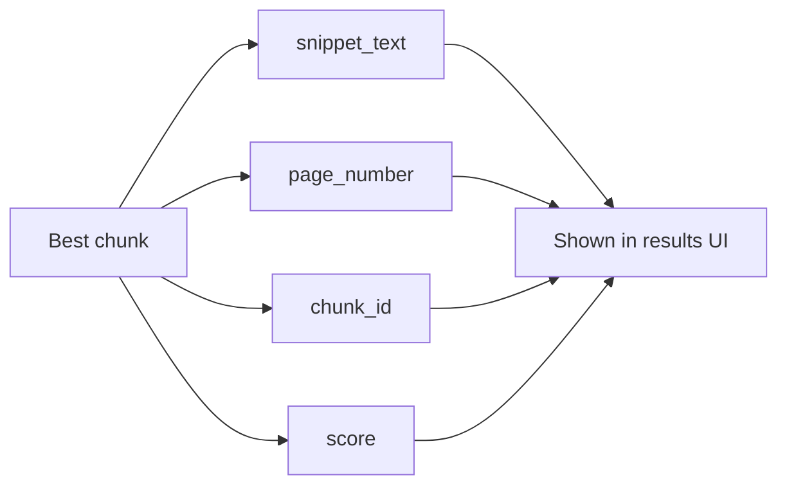
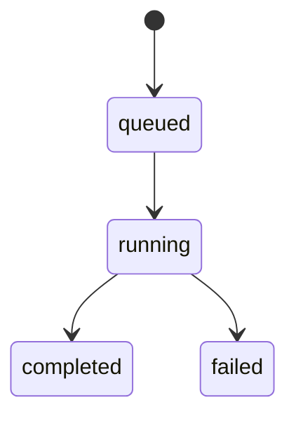
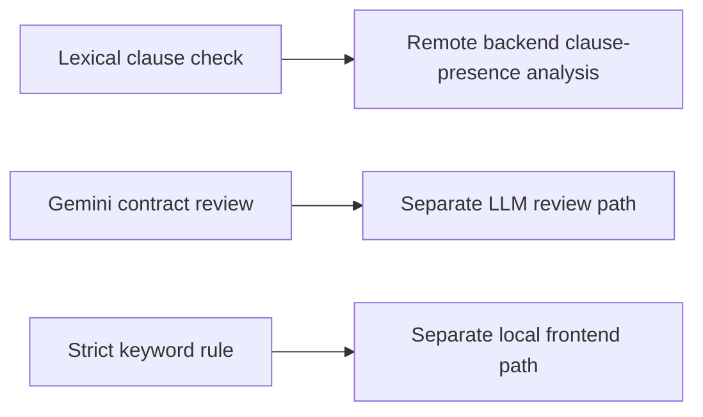

# Clause-Presence Checks

## User flow

### Current scope
- Run against all documents or a selected set
- Return one result per document
- Show summary, confidence, and evidence snippets

## Frontend rule mapping

- `Lexical clause check`: frontend rule type `clause_presence`; runs the backend clause-presence analysis described in this doc
- `Gemini contract review`: frontend rule type `gemini_review`; uses the separate LLM review path and is not covered by this doc
- `Strict keyword check`: frontend rule type `keyword_match`; runs locally in the frontend and is not covered by this doc

## Technical flow

### Main files
- `frontend/src/pages/GuidelineRunPage.tsx`
- `frontend/src/pages/GuidelinesPage.tsx`
- `frontend/src/api/client.ts`
- `go-api/internal/http/handlers/checks.go`
- `py-ai-api/py_ai_api/analysis.py`
- `py-ai-api/py_ai_api/main.py`

## How matching works

### Data source
- Uses indexed chunks, not whole-document text
- Loads up to 64 chunks per document from Qdrant-backed retrieval

## Decision logic

### Current outputs
- `match`: strong evidence that the clause is present
- `review`: some overlap, but not enough for automatic confidence
- `missing`: no convincing evidence found

## Evidence model

### What the reviewer sees
- Outcome
- Confidence %
- Short summary
- Evidence snippet with page reference

## Status flow

## Important nuance

- This doc describes the backend clause-presence feature behind the `Lexical clause check` rule type
- It is different from both the `Gemini contract review` path and the local `Strict keyword check` path in the UI

## Limitations
- Lexical matching can miss paraphrased clauses
- Best-chunk selection may miss distributed language across multiple chunks
- `context_hint` exists in the request shape but is not used in current analysis
- Results depend on ingestion quality and chunking quality
