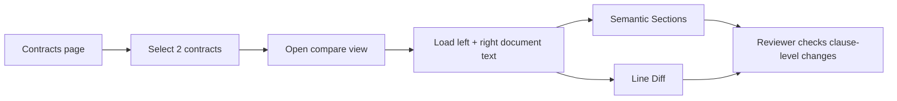
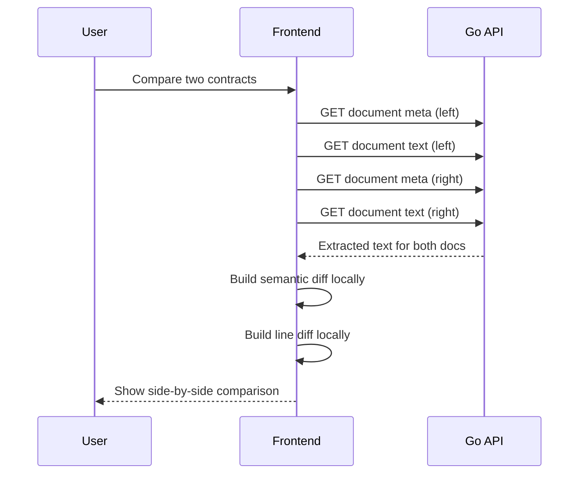
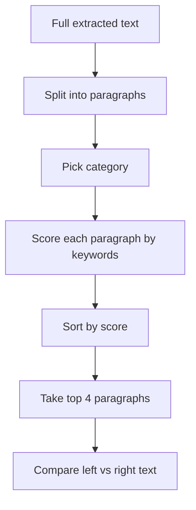
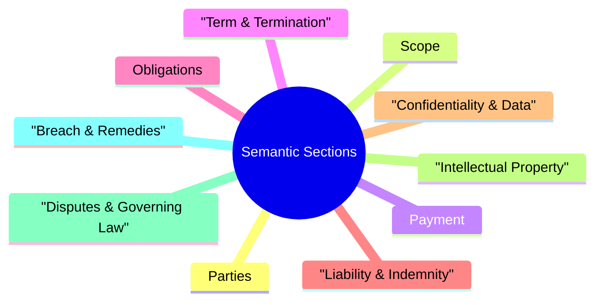
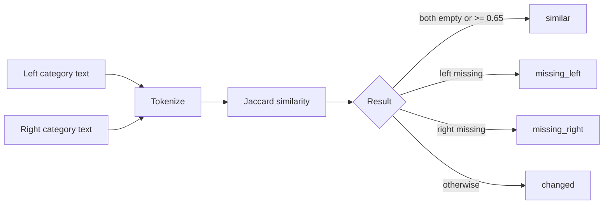
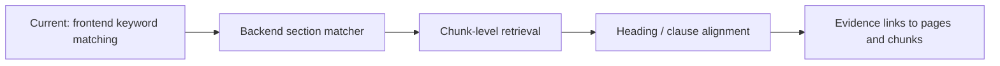

# Contract Comparison

## User flow

### Current scope
- Compare 2 document files
- If a contract has multiple files, the UI picks one representative file
- Two modes: `Semantic Sections` and `Line Diff`

## Technical flow

### Main files
- `frontend/src/pages/ContractsPage.tsx`
- `frontend/src/pages/CompareContractsPage.tsx`
- `frontend/src/pages/contractCompare.ts`
- `go-api/internal/http/handlers/documents.go`

## How we decide which contract parts to fetch

### Current rule
We do not fetch clause sections from the backend yet.

### Categories

### Matching rule
- Split text on blank lines
- Ignore very short paragraphs
- Score paragraphs by category keywords
- Multi-word keywords get slightly more weight
- Join the top 4 matches per category

## Similarity rule

## Limitations
- Keyword matching can miss unusual wording
- Wrong paragraphs can be selected when terms overlap
- No heading or clause-number awareness yet
- No chunk-level or vector-based alignment yet

## Next likely step

